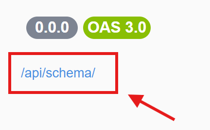
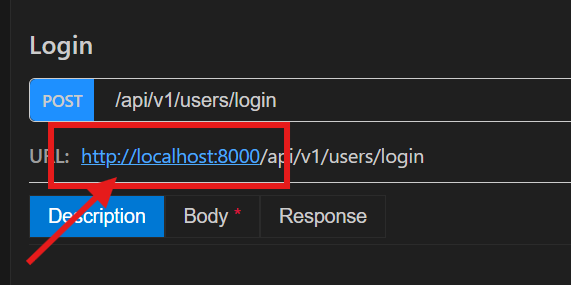

# Spaghetti (OpenAPI Renderer)

Spaghetti is a modern, intuitive, and customizable **API documentation renderer for VS Code**, designed for developers who want more flexibility and a better in-editor experience than traditional tools like Swagger UI, ReDoc, Postman, or RapidAPI.

---

## 🚀 Overview

Spaghetti provides a smooth and interactive interface for exploring, testing, and understanding APIs **directly inside VS Code**. It is inspired by existing API tools but built with a strong focus on usability, performance, and developer workflow.

Instead of switching between browsers and external tools, Spaghetti keeps your API documentation and exploration where you write your code.

Whether you’re working with **FastAPI, Express, Django, Laravel**, or any backend framework that exposes an OpenAPI specification, Spaghetti helps you visualize and work with your API efficiently.

---

## ✨ Features

- 🧭 **Clean and modern UI** – Easy to navigate and visually focused.
- ⚡ **Fast and responsive** – Optimized for smooth interactions inside VS Code.
- 📚 **OpenAPI rendering** – View endpoints, schemas, and models clearly.
- 🧩 **Complex schema support** – Supports `oneOf`, `anyOf`, `allOf`, and nested models.
- 🗂️ **Multi-project support** – Load and switch between multiple OpenAPI projects.
- 🔄 **Project reload** – Re-fetch API specs from file or URL when changes occur.
- 🧠 **State-aware panels** – Automatically closes stale views when project data changes.
- **Search enpoint** - Easy search for endpoint
- **Offline note** - Keep note per endpoint and track note status.

> More features such as request execution, environments, and variables are actively planned.

---

Here is a corrected and polished version with improved grammar, clarity, and consistency (especially for technical documentation and UI instructions).

---

## 📦 Installation

1. Open **VS Code**
2. Go to the **Extensions Marketplace**
3. Search for **Spaghetti (OpenAPI Renderer)**
4. Install the extension and reload VS Code

---

## 🛠️ Getting Started

1. Open the **Spaghetti** sidebar.

2. In the **Projects** view, click the **+** icon.

3. Select **Add New** from the quick menu.

4. Choose a source.

   > For a **URL source**, if you don’t know your schema URL, you can locate and copy it from your Swagger API documentation as shown in the image below.
   > 

5. Your project is now added. Open the **Endpoints** tree view from the sidebar and select an endpoint to open the endpoint panel.

6. Change the default domain URL to your API base URL (see the image below).
   

7. Set the request body and parameters, then click **Send Request**.

8. Done.

9. You can also explore other features such as **History**, **Favorites**, and **Comments**.

---

## 💡 Motivation

My first exposure to API documentation was through **FastAPI’s built-in Swagger UI**, which later led me to tools like ReDoc, Postman, and RapidAPI.

While these tools are powerful, I wanted:

- tighter VS Code integration
- better control over presentation
- a smoother, more focused developer experience

Spaghetti is built to solve those needs—and to grow based on real developer feedback.

---

## 📄 License

MIT License
